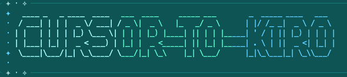

# Cursor to Kiro


[](https://github.com/azrael8576/cursor-to-kiro/actions/workflows/quality.yml)
[](https://github.com/azrael8576/cursor-to-kiro/releases)
[](https://github.com/azrael8576/cursor-to-kiro/blob/main/LICENSE)



> 中文版說明請見 [docs/README_tw.md](docs/README_tw.md)。

An interactive CLI that helps you move your Cursor configuration over to Kiro.

Pick the items you want to migrate, and `cursor-to-kiro` automatically converts the compatible settings. When it finishes, it clearly lists which items have no equivalent and need manual review.

---

## Install & Use

```bash
npm install
npm run build
```

```bash
cd <your-repo>
cursor-to-kiro
```

---

## Compatibility

Four categories of configuration are supported: **Rules**, **Skills**, **Subagents**, and **Hooks**.

| Icon | Meaning |
| --- | --- |
| ✅ | Supported, converted directly |
| ⚠️ | Partially supported; the conversion flags the difference or produces a draft that needs review |
| ❌ | Not supported; reported item by item |

### Rules

| Item | Status |
| --- | --- |
| `.cursor/rules/**/*.mdc` Project Rules | ✅ |
| `alwaysApply` / `globs` / `description` activation modes | ✅ |
| File references in the body (`mdc:` / `@path`) | ✅ |
| Legacy `.cursorrules` | ❌ |
| Unknown frontmatter fields | ❌ |
| Advanced glob syntax (`!`, `{}`, `[]`, extglob) | ❌ |
| Missing reference targets, symlinks, discovery conflicts | ❌ |

### Skills

| Item | Status |
| --- | --- |
| Standard Agent Skills (frontmatter + bundle) | ✅ |
| Resource structure and file permissions | ✅ |
| Relative Markdown links (including cross-package) | ✅ |
| `icon` / `color` | ⚠️ Preserved in metadata; badge appearance not guaranteed |
| `disable-model-invocation: true` | ⚠️ Converted to manual steering |
| `paths` / `globs` load conditions | ⚠️ Load-timing differences are flagged |
| Subtree skills | ⚠️ Produces a draft when the pattern intersection cannot be verified |
| `allowed-tools`, manual scope, unknown fields | ⚠️ Source fields preserved; not auto-loaded |
| Standard limits such as file name and description length | ✅ Validated before conversion |

### Subagents

| Item | Status |
| --- | --- |
| Ordinary roles (name / description / body) | ✅ |
| File references converted to agent resources (`file://` / `skill://`) | ✅ |
| `readonly: true` | ⚠️ Provides read-only file access only; stricter than Cursor |
| `model: inherit` / unspecified | ⚠️ Uses the Kiro default; parent model inheritance not guaranteed |
| Specified model, background scheduling, unknown fields | ⚠️ Produces a draft that needs review |
| Cursor's automatic MCP / steering inheritance | ❌ |

### Hooks

> All hook artifacts are disabled by default (`enabled: false`) and marked as DRAFT. Verify against your target Kiro version before enabling them.

| Cursor event | Kiro equivalent | Status |
| --- | --- | --- |
| `sessionStart` | `SessionStart` | ✅ |
| `preToolUse` / `postToolUse` | `PreToolUse` / `PostToolUse` | ✅ |
| `beforeSubmitPrompt` | `UserPromptSubmit` | ✅ |
| `stop` | `Stop` | ✅ |
| `beforeReadFile` | `PreToolUse` + read filtering | ✅ |
| Before/after shell / MCP execution | Tool events + adapter conversion | ⚠️ Needs verification |
| `afterFileEdit` | `PostFileSave` | ⚠️ Trigger and payload differences need verification |
| `sessionEnd` and other events with no equivalent | — | ❌ |

---
